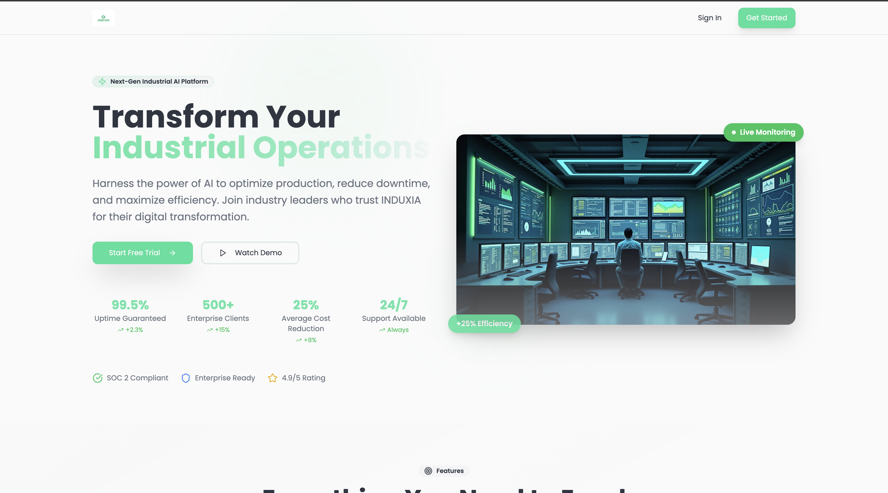
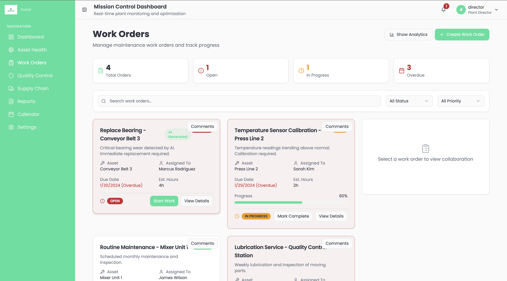
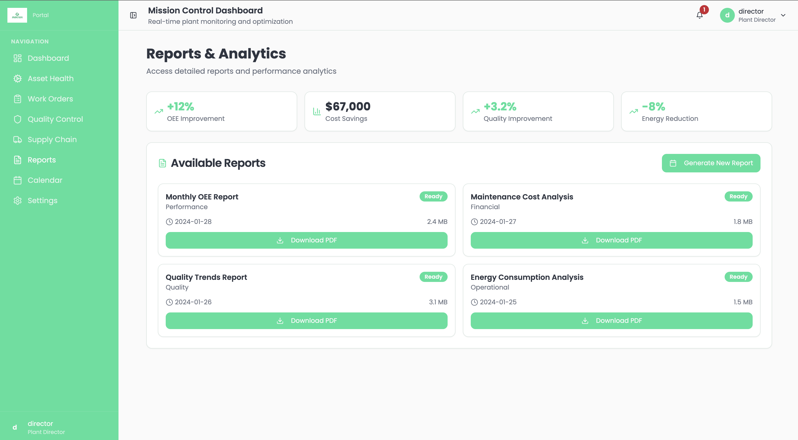

# **INDUXIA Insight Hub**



> A modern industrial performance-intelligence platform that brings production, quality, maintenance and supply-chain data together in one place – powered by Supabase and serverless AI agents.

---

## ✨ Key Capabilities

| Area | Highlights |
|------|------------|
| Production | Real-time Overall Equipment Effectiveness (OEE) gauge, interactive production charts, work-order flow |
| Maintenance | Calendar-driven preventive schedule, asset-health timeline & sensor dashboard |
| Quality | Issue logging, RCA collaboration & resolution tracking |
| Supply-Chain | SKU availability, inbound/outbound tracking, BOM risk alerts |
| Collaboration | Comment threads, notifications & role-based dashboards |
| AI Assistance | Automated insights, anomaly detection & n8n-routed agent actions |

For a deep-dive, read the documentation pages in the [`/wiki`](wiki/) folder:

1. **[Overview & Architecture](wiki/overview.md)** – high-level picture of frontend, backend and AI layer.
2. **[Feature Catalogue](wiki/page-features.md)** – every page & component with screenshots.
3. **[Roles & Permissions](wiki/role-views.md)** – what each persona sees and can do.
4. **[Backend & AI Agents](wiki/backend-ai.md)** – Supabase schema, edge functions & agent workflows.
5. **[Running & Deployment](wiki/how-to-run.md)** – local dev, env vars and production build.

---

## 🚀 Quick Start

```bash
# 1. clone & install
$ git clone https://github.com/youssefmourad1/INDUXIA.git
$ cd INDUXIA/induxia-insight-hub
$ npm install # or pnpm install / yarn

# 2. set up your environment
# copy the example and fill in your Supabase credentials
$ cp .env.example .env

# 3. run the app
$ npm run dev
```
The Vite dev-server starts on **http://localhost:8080**.

To enable the Supabase edge-functions locally you can run:
```bash
supabase start
```
Make sure you have the Supabase CLI installed.

---

## 📸 Gallery

Below are a few representative screens – more inside the wiki.

| Dashboard | Asset Health | Work Orders | Reports |
|-----------|--------------|------------|---------|
|  |  |  |  |

---

## 🛠️ Tech Stack

* **Frontend** – React 18, TypeScript, Vite, Tailwind CSS + shadcn/ui
* **State** – TanStack Query
* **Authentication & DB** – Supabase
* **Serverless** – Supabase Edge Functions (TypeScript)
* **Observability** – Supabase logs, Vite overlay
* **AI** – n8n-bridged agents for predictive insights and automated actions

---

## License

MIT © 2025 INDUXIA
