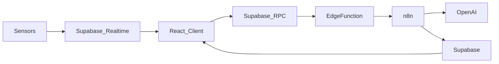

# Backend & AI Agents

## Supabase Schema (simplified)

| Table | Purpose |
|-------|---------|
| `users` | Extended profile fields (role, department, avatar, shift) |
| `assets` | Machines, lines, sensors metadata |
| `work_orders` | Maintenance tasks incl. status, priority, assigned_to |
| `quality_incidents` | NCRs with 5-why fields & attachments |
| `inventory_items` | Stock levels, reorder points, supplier links |
| `sensor_readings` | Time-series, ingested via Realtime channels |

Row-level security ensures users see only what they’re allowed to.

## Edge Functions

* **create-demo-accounts** – seeds the database with sample users & demo data.
* **n8n-agent-bridge** – secure webhook → triggers n8n workflows that call AI models.
* **health-check** – basic ping for uptime monitoring.

## n8n Workflows

1. **Anomaly Detection** – fetch latest sensor values, call OpenAI, produce alerts.  
2. **Auto Work-Order** – when OEE drops ↘, generate a draft WO assigned to Maint. Eng.  
3. **Incident Summary** – summarise quality incident description + next steps.  
4. **Daily Digest** – email PDF report of key KPIs to Plant Director.

## Data Flow

