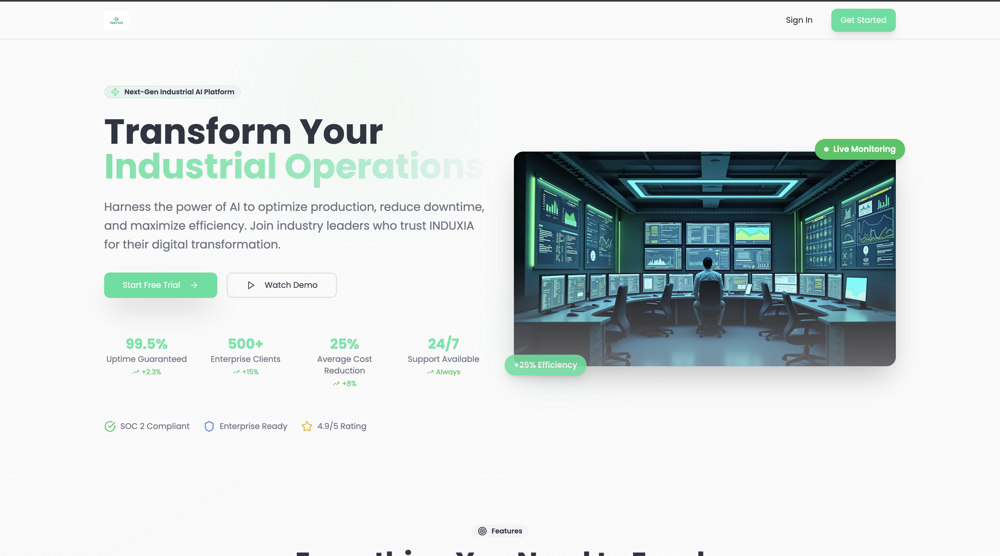
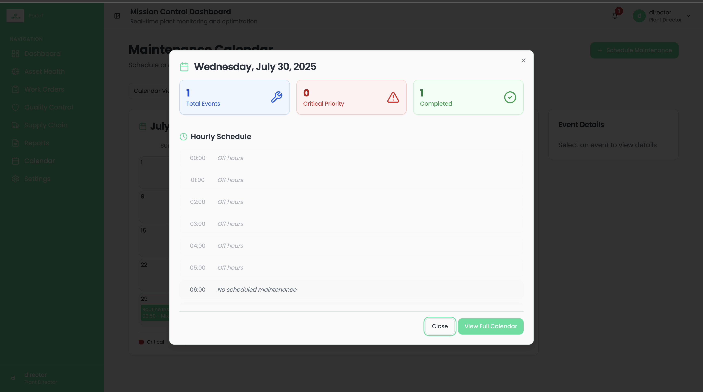
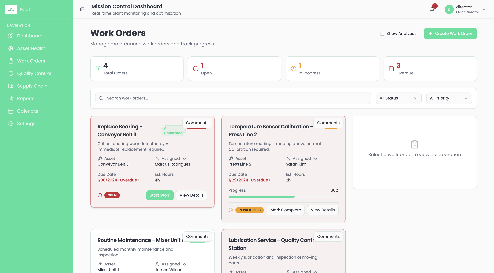
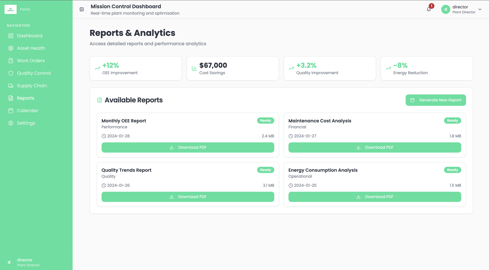

# Feature Catalogue

| Page | Route | Description | Screenshot |
|------|-------|-------------|------------|
| Home / Landing | `/` | Marketing splash with quick KPI glimpse. |  |
| Director Dashboard | `/dashboard/director` | Cross-functional overview: production KPIs, alerts & AI insights. |  |
| Asset Health | `/assets/:id/health` | Live sensor gauges, health history timeline. |  |
| Calendar (Maintenance) | `/maintenance/calendar` | Drag-and-drop preventive schedule, Day-detail modal. |  |
| Work Orders | `/work-orders` | Kanban view of open, in-progress and closed orders. |  |
| Reports | `/reports` | Customisable charts, export to CSV/PDF. |  |
| Supply Chain | `/supply-chain` | Material availability & risk heat-map. |  |
| Quality Control | `/quality` | Incident log, root-cause analysis worksheets. |  |

> 📌 **Tip:** most pages leverage *shadcn/ui* components for consistency and rapid iteration. 