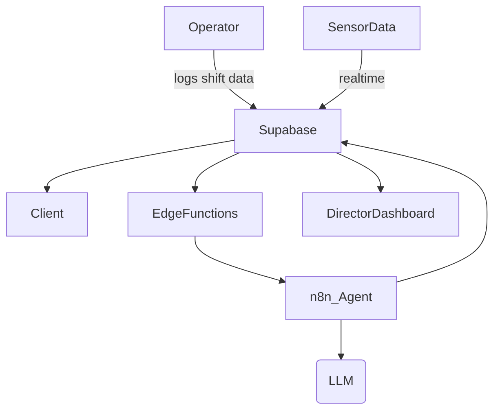

# Roles & Permissions

INDUXIA supports **granular, role-based access** handled by Supabase *row-level security* and React-Router guards.

| Role | Landing Dashboard | Core Permissions |
|------|-------------------|------------------|
| **Plant Director** | Director Dashboard | View all KPIs, approve budgets, assign work-orders, view AI insights |
| **Maintenance Engineer** | Maintenance Calendar | Create/close work-orders, update asset specs, access sensor data |
| **Quality Manager** | Quality Control | Log incidents, run RCA, approve corrective actions |
| **Supply-Chain Lead** | Supply Chain Page | Monitor inventory, raise purchase orders, view supplier risk alerts |
| **Operator** | Role Dashboard (custom) | Log production data, acknowledge alerts |

## Interaction Flow

1. **Client request** is authenticated via Supabase Auth (JWT).  
2. The requested data is subjected to **RLS policies** based on the user role.  
3. **Edge Functions** can be invoked for heavy tasks or to trigger AI workflows.  
4. **n8n** calls the AI model & writes results back, which propagate realtime to dashboards. 